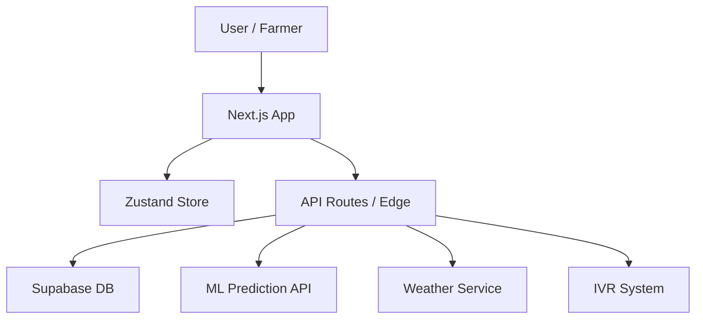

# 🌾 AgriSaarthi — Your Digital Farming Companion

[](https://nextjs.org/)
[](https://www.typescriptlang.org/)
[](https://supabase.com/)
[](https://firebase.google.com/)

**AgriSaarthi** is a cutting-edge agricultural intelligence platform designed to empower Indian farmers with real-time data, AI-driven insights, and localized advisory services. Built with a focus on accessibility and regional relevance, it bridges the gap between traditional farming and modern technology.

---

## 🌟 Key Features

### 🚜 Smart Dashboard
Get a high-level overview of your farm's health, upcoming tasks, and critical alerts. Personalized for **Vineet Mittal** in **Gwalior, Madhya Pradesh**.

### 🔍 AI Disease Detection
Identify crop diseases instantly by uploading a photo. Powered by a custom-trained **Plant-Disease-Model** with 90%+ accuracy and automated treatment advisory.

### 🌤️ Hyper-Local Weather
Real-time weather tracking and 7-day forecasts specifically tuned for the **Gwalior district**, helping you plan sowing and irrigation cycles.

### 📈 Real-time Mandi Prices
Stay updated with the latest market rates from local mandis to ensure you get the best price for your produce.

### 🏛️ Government Schemes (PM-Kisan & State Specific)
Curated list of agricultural schemes including **Madhya Pradesh Fal Podharopan Yojana** and **Irrigation Tax Waivers**, filtered by eligibility.

### 📞 IVR & Voice Assistant
An integrated AI Voice Agent that allows farmers to interact with the platform via simple phone calls, breaking the literacy barrier.

---

## 🛠️ Technology Stack

| Layer | Technology |
| :--- | :--- |
| **Frontend** | Next.js 16 (App Router), React, Tailwind CSS |
| **State Management** | Zustand |
| **Backend** | Next.js Route Handlers (Edge Runtime) |
| **Database** | Supabase (PostgreSQL) |
| **Authentication** | Firebase Auth (Bypassed for Demo) |
| **Icons** | Lucide React |
| **AI/ML** | Plant-Disease-Model (External API) |

---

## 🚀 Getting Started

### 1. Clone the repository
```bash
git clone https://github.com/vineetm1204-m/agrisaarthi.git
cd agrisaarthi
```

### 2. Install dependencies
```bash
npm install
```

### 3. Environment Setup
Create a `.env.local` file and add your credentials:
```env
NEXT_PUBLIC_SUPABASE_URL=your_supabase_url
NEXT_PUBLIC_SUPABASE_ANON_KEY=your_supabase_key
NEXT_PUBLIC_FIREBASE_API_KEY=your_firebase_key
```

### 4. Run Development Server
```bash
npm run dev
```
The app will be available at `http://localhost:3000`.

---

## 📱 Mobile-First Design
AgriSaarthi features a premium, responsive interface:
- **Left Sidebar Drawer**: Accessible via a hamburger menu on mobile.
- **Smart Search**: Quickly jump to any section like "Weather" or "Schemes" by typing.
- **Optimized for Low Bandwidth**: Light-weight assets and edge-cached API routes.

---

## 🗺️ Project Architecture



---

## 🤝 Contribution
Designed and Developed by **Vineet Mittal**.

> "For the farmers, by the farmers. 🇮🇳"
