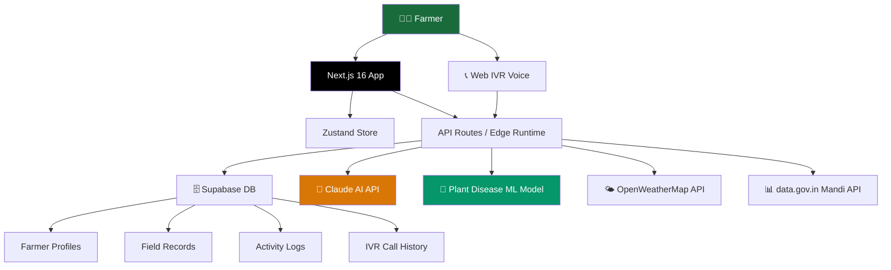

<div align="center">

<!--  -->

# 🌾 AgriSaarthi

### *Har Kisan Ka Digital Saathi*

**India's most comprehensive AI-powered agricultural intelligence platform —**
**built for every farmer, in every language, on every device.**

<br/>

[](https://nextjs.org/)
[](https://www.typescriptlang.org/)
[](https://supabase.com/)
[](https://firebase.google.com/)
[](https://tailwindcss.com/)
[](LICENSE)

<br/>

[🚀 Live Demo](#-live-demo) · [✨ Features](#-features) · [🛠️ Tech Stack](#️-tech-stack) · [⚡ Quick Start](#-quick-start) · [🗺️ Architecture](#️-architecture)

<br/>

> **150 million Indian farmers. Most don't speak English. Almost none have access to real-time, personalized agricultural intelligence.**
> AgriSaarthi was built to change that.

</div>

---

## 🎯 What is AgriSaarthi?

AgriSaarthi is not a chatbot. It is not a single-feature app. It is a **full-stack digital agricultural services platform** that brings together artificial intelligence, machine learning, real-time market data, and voice technology — all in one place, all in Hindi and English, accessible to any farmer regardless of device or literacy level.

Think of it as having a **personal agronomist, a market analyst, a government scheme advisor, and a weather forecaster** — all available 24/7, speaking your language, knowing your farm.

---

## 🌟 Features

<details>
<summary><b>🚜 Smart Personalized Dashboard</b></summary>
<br/>

Your farm's command center. The dashboard surfaces the most relevant information every morning without the farmer needing to navigate or search.

- **Today's weather snapshot** for your exact district
- **Crop calendar** — tasks due this week based on your sowing dates
- **Live mandi price** for your primary crop
- **Active disease alerts** for your region
- **Today's irrigation recommendation** computed overnight
- **Government scheme count** — how many you qualify for right now

Everything is proactive. The platform comes to you.

</details>

<details>
<summary><b>🔬 AI Plant Disease Detection</b></summary>
<br/>

Point. Shoot. Know in 30 seconds.

- **Live camera scan** — no upload required
- Powered by a custom-trained **Plant Disease ML Model** with 90%+ accuracy across 38 disease categories
- Diagnosis includes: disease name, severity, how it spreads, organic remedy, chemical treatment, estimated cost in ₹
- **Full explanation in Hindi** — not just a label, a complete advisory
- Results automatically saved to field disease history

</details>

<details>
<summary><b>💧 Smart Irrigation Advisory + Simulator</b></summary>
<br/>

Stop guessing. Start irrigating with precision.

- ML model calculates daily water requirement using **Penman-Monteith ET₀ formula**
- Combines: crop type, growth stage, soil type, real-time weather, and rainfall forecast
- Output: exact hours to irrigate + best time of day
- **Irrigation Simulator** — test different irrigation scenarios virtually before committing a single drop
- Weekly forecast strip — irrigation plan for next 7 days
- Tracks water saved vs. district average farmer

</details>

<details>
<summary><b>📊 Real-time Mandi Price Intelligence</b></summary>
<br/>

The information gap between farmers and traders — closed.

- Live wholesale prices from **data.gov.in** Agmarknet API
- Price comparison across all nearby mandis
- 30-day price trend chart
- **Price alerts** — get notified when your crop hits your target price
- Best mandi of the day highlighted automatically

</details>

<details>
<summary><b>🌤️ Hyper-Local Weather & Agricultural Advisories</b></summary>
<br/>

Weather built for farmers, not just forecasters.

- 7-day forecast tuned to your **exact district**
- Hourly temperature + rainfall chart
- **Spray advisory** — should you spray today based on wind and rain?
- Frost alerts, heat stress warnings, harvest weather windows
- Historical comparison — this month vs. same month last year

</details>

<details>
<summary><b>🏛️ Government Scheme Navigator</b></summary>
<br/>

Crores of rupees in unclaimed entitlements. We help you claim them.

- AI cross-references **30+ active central and state schemes** against your profile
- Includes: PM-KISAN, PMFBY, KCC, PKVY, MP-specific schemes
- Shows: benefit amount, eligibility, required documents, application link
- Step-by-step application guide for each qualifying scheme
- Scheme search and filter by category

</details>

<details>
<summary><b>📞 Web IVR & AI Voice Assistant</b></summary>
<br/>

Talk to your farm's AI expert. No app needed.

- **Browser-based voice calling** — speak in Hindi or English, get spoken answers
- AI agent "Saarthi" responds with live weather, mandi prices, disease advice
- **Zero telecom dependency** — built entirely with Web Speech API
- Voice Chat for smartphone users — speak your query, hear the answer
- Full call transcript saved after every session

</details>

<details>
<summary><b>♻️ Carbon Credit Calculator</b></summary>
<br/>

Sustainable farming shouldn't just be good for the planet — it should pay.

- Calculate carbon credits earned through cover cropping, reduced tillage, organic practices
- Track credit accumulation over time
- Convert credits to estimated earnings
- Pending verification tracker per field

</details>

<details>
<summary><b>📋 Field Management</b></summary>
<br/>

Your farm's digital memory.

- Register multiple fields with GPS location, soil type, crop, sowing date
- Log every activity — fertilizer, pesticide, irrigation, harvest
- Full activity timeline per field
- Irrigation and disease history charts
- Crop calendar — what to do this week based on your sowing date

</details>

---

## 🛠️ Tech Stack

| Layer | Technology | Purpose |
| :--- | :--- | :--- |
| **Frontend** | Next.js 16 (App Router) + React | Full-stack web application |
| **Language** | TypeScript 5.0 | Type-safe development |
| **Styling** | Tailwind CSS | Mobile-first responsive UI |
| **State** | Zustand | Lightweight global state |
| **Database** | Supabase (PostgreSQL) | Farmer profiles, field data, logs |
| **Auth** | Firebase Authentication | Phone OTP + Google login |
| **AI Engine** | Claude API (Anthropic) | Hindi responses, scheme matching |
| **ML Model** | Plant Disease Model (External API) | Crop disease detection |
| **Weather** | OpenWeatherMap API | Real-time forecasts |
| **Market Data** | data.gov.in Agmarknet API | Live mandi prices |
| **Voice** | Web Speech API + SpeechSynthesis | Browser-based IVR |
| **Icons** | Lucide React | UI iconography |
| **Runtime** | Edge Runtime | Low-latency API routes |

---

## 🚀 Quick Start

### Prerequisites

- Node.js 18+
- npm or yarn
- Supabase account
- Firebase project

### 1. Clone the repository

```bash
git clone https://github.com/vineetm1204-m/agrisaarthi.git
cd agrisaarthi
```

### 2. Install dependencies

```bash
npm install
```

### 3. Configure environment

Create a `.env.local` file in the root directory:

```env
# Supabase
NEXT_PUBLIC_SUPABASE_URL=your_supabase_project_url
NEXT_PUBLIC_SUPABASE_ANON_KEY=your_supabase_anon_key

# Firebase
NEXT_PUBLIC_FIREBASE_API_KEY=your_firebase_api_key
NEXT_PUBLIC_FIREBASE_AUTH_DOMAIN=your_project.firebaseapp.com
NEXT_PUBLIC_FIREBASE_PROJECT_ID=your_project_id

# AI & Data APIs
ANTHROPIC_API_KEY=your_claude_api_key
OPENWEATHER_API_KEY=your_openweathermap_key
DATA_GOV_API_KEY=your_data_gov_key
```

### 4. Run the development server

```bash
npm run dev
```

Open [http://localhost:3000](http://localhost:3000) in your browser.

> **💡 Demo Mode:** The app works out of the box with a pre-configured demo profile. Some features use live APIs while others showcase the full UI experience — perfect for exploring all modules instantly without setup.

---

## 🗺️ Architecture



---

## 📱 Mobile-First Design Highlights

- **Sidebar drawer** accessible via hamburger menu on mobile
- **Smart search** — jump to any section by typing
- **Icon-based navigation** designed for low digital literacy users
- **Hindi-first UI** — all labels, buttons, and responses available in Hindi
- **Optimised for low bandwidth** — edge-cached routes, lightweight assets
- **PWA-ready** — installable on Android home screen

---

## 📂 Project Structure

```
agrisaarthi/
├── app/
│   ├── (dashboard)/
│   │   ├── page.tsx              # Smart Dashboard
│   │   ├── disease-detection/    # ML Disease Scanner
│   │   ├── irrigation/           # Irrigation Advisory + Simulator
│   │   ├── mandi-prices/         # Live Market Prices
│   │   ├── weather/              # Weather Dashboard
│   │   ├── govt-schemes/         # Scheme Navigator
│   │   ├── ivr-call/             # Web IVR Voice System
│   │   ├── carbon-credits/       # Carbon Credit Calculator
│   │   └── my-fields/            # Field Management
│   └── api/
│       ├── ivr/                  # Voice AI route handler
│       ├── disease/              # Disease explanation route
│       ├── schemes/              # AI scheme matching route
│       ├── weather/              # Cached weather route
│       └── mandi/                # Cached mandi prices route
├── components/
│   ├── CallUI.tsx                # Web IVR interface
│   ├── SoundWave.tsx             # Voice animation
│   └── TranscriptBubble.tsx     # Call transcript
├── hooks/
│   ├── useSpeech.ts              # Speech recognition + synthesis
│   ├── useCallState.ts           # IVR state machine
│   └── useAudioTone.ts           # Ring/end tones
├── lib/
│   ├── supabase.ts               # Supabase client
│   ├── claude.ts                 # Anthropic client
│   ├── fetchWeather.ts           # Weather helper
│   └── fetchMandi.ts             # Mandi data helper
└── store/
    └── farmStore.ts              # Zustand global store
```

---

## 🌍 Impact

| Metric | Value |
| :--- | :--- |
| Target farmers | 150 million+ smallholders |
| Languages supported | Hindi, English |
| Government schemes covered | 30+ central + state |
| Disease categories detected | 38 crop diseases |
| Access channels | Web app + Voice IVR |
| Internet required | Optional (Voice works offline-first) |

---

## 🤝 Contributing

Contributions, issues, and feature requests are welcome.

1. Fork the repository
2. Create your feature branch (`git checkout -b feature/AmazingFeature`)
3. Commit your changes (`git commit -m 'Add AmazingFeature'`)
4. Push to the branch (`git push origin feature/AmazingFeature`)
5. Open a Pull Request

---

## 👨‍💻 About

Designed and developed by **Vineet Mittal** and **Team NullPointers**.


* Built for ZYNK — an internal college hackathon.
* Shipped from zero in under 5 hours on the spot.
* Demo mode: farmer profile is pre-configured (Gwalior, MP).
* Data sources: mix of live APIs (weather, mandi), 
* simulated values (irrigation ML, carbon credits), 
* and the plant disease model via external hosted API.
* Auth is bypassed in demo — Firebase configured but login skipped.


---

<div align="center">

**AgriSaarthi**

*Har kisan ka digital saathi 🌱*

Made with ❤️ for the farmers of India 🇮🇳

</div>